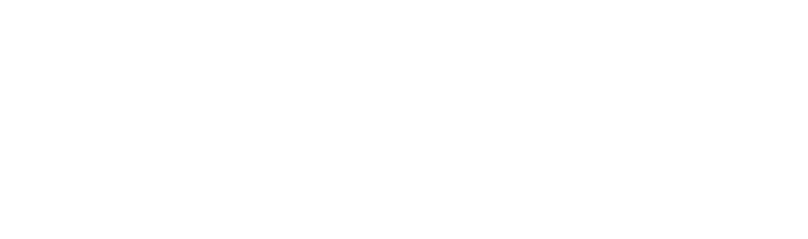

 

 <h1>EIP Wiki By 2077 Collective</h1>

The EIP Wiki by the 2077 Collective is a comprehensive and user-friendly resource for everything EIP-related. Here, you can explore ongoing proposals, gain insights into historical changes, and participate in discussions shaping the future of Ethereum.

## About EIP Wiki
EIP Wiki is a database featuring articles in the style of Investopedia or Binance Academy, focused on Ethereum Improvement Proposals (EIPs) and Ethereum Request for Comments (ERCs). Our goal is to provide easy-to-digest explainers of each EIP and ERC, detailing their functions and impacts.

## Why EIPs Matter
Ethereum Improvement Proposals are a crucial mechanism for enhancing and governing the Ethereum blockchain. They allow developers and community members to propose, debate, and implement changes in a structured and transparent manner. EIPs ensure that Ethereum can evolve, address emerging needs, and maintain its security and efficiency. 

## Features
- **Ongoing Proposals:** Stay updated with the latest EIP submissions.
- **Historical Changes:** Understand the evolution of Ethereum through detailed records of past proposals.
- **Community Discussions:** Engage with the community and contribute to shaping the future of Ethereum.

## Contribution
We welcome contributions from the community. Whether it's updating existing entries or adding new ones, your input helps us maintain a valuable resource for everyone.

To learn how to getting started, please refer to [Contributing Guidelines](./CONTRIBUTING.md).

